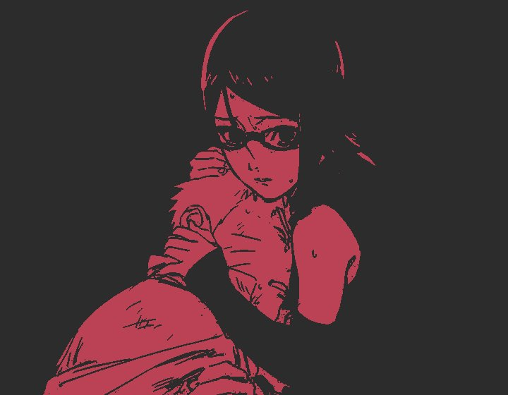

<div align="center">



# PICLY

buscador e editor de artes de anime para criar seu pfp perfeito  
anime art finder to create your perfect pfp


</div>

> [Português](#sobre) | [English](#about)

---

## Sobre

PICLY é uma aplicação web pra buscar artes de anime pfp, wallpaper, matching, o que precisar. a ideia surgiu da vontade de ter algo parecido com o Pinterest mas focado em anime, e com edição de imagem direto no site.

o projeto ainda tá em desenvolvimento ativo, então a parte visual principalmente vai mudar bastante com o tempo. então podem ocorrer bugs, e instabilidades, é normal. sou só um estudante fazendo isso pra aprender e por hobbie, então erros fazem parte do processo.

### o que já tem

```
> busca por tags com autocomplete
> grid estilo masonry (tipo pinterest)
> scroll infinito
> filtros de pesquisa
> modal com a imagem ampliada
> imagens relacionadas no modal
> download direto
> badge mostrando a fonte da imagem
> remoção de fundo com ia (rembg)
```

### fontes de imagem

```
| Safebooru  -> busca geral        | ativo
| Gelbooru   -> busca geral        | ativo
| Yande.re   -> alta qualidade     | ativo
| Konachan   -> wallpapers         | só no filtro wallpaper
| Nekosia    -> complementar sfw   | ativo
| Danbooru   -> busca geral        | parcial
```

### o que ainda vem

```
> fundo preto + borda branca pra pfp
> filtros de imagem (brilho, contraste, etc)
> cropper de banner + avatar estilo discord/twitter
> sistema de favoritos
> versão como app instalável
> bot pro discord
```

### visão de futuro

a ideia é o PICLY virar uma alternativa ao Pinterest com opções de edição pro universo anime um lugar onde você acha a arte perfeita, edita, recorta e exporta tudo pronto pra usar como pfp em qualquer plataforma. sem sair do site, e sem aplicativos externos.

### tech

```
backend  -> Python, Flask
frontend -> HTML5, CSS3, JavaScript puro
layout   -> Masonry.js
apis     -> Safebooru, Danbooru, Gelbooru, Yande.re, Konachan, Nekosia
futuro   -> Pillow
```

### estrutura

```
picly/
\-- app.py
\-- requirements.txt
\-- sources/
|   \-- safebooru.py
|   \-- danbooru.py
|   \-- gelbooru.py
|   \-- yandere.py
|   \-- konachan.py
|   \-- nekosia.py
\-- static/
|   \-- css/style.css
|   \-- js/main.js
\-- templates/
|   \-- index.html
\-- uploads/
```

### como rodar

```bash
git clone https://github.com/y3levi/picly.git
cd picly

python -m venv .venv
.venv\Scripts\activate

pip install -r requirements.txt
python app.py
```

acessa em `http://127.0.0.1:5000`

### screenshots

> prints em breve — visual ainda tá mudando bastante

<!-- quando tiver:


-->

[](https://www.linkedin.com/in/yagoleviy3/)
[](https://github.com/y3levi)

---

## About

PICLY is a web app for searching anime artwork — pfp, wallpaper, matching, whatever you need. the idea came from wanting something like Pinterest but focused on anime, with image editing built right into the site.

the project is still under active development, so the visual side especially will change a lot over time. bugs and broken stuff can happen — that's fine. i'm just a student building this to learn and as a hobby, so expect some rough edges :)

### current features

```
> tag search with autocomplete
> masonry grid layout (like pinterest)
> infinite scroll
> filters -> solo | animated | monochrome | wallpapers | 2girls
> image modal with full size view
> related images inside the modal
> direct download
> source badge showing where each image came from
> ai background removal (rembg)
```

### image sources

```
| Safebooru  -> general search     | active
| Gelbooru   -> general search     | active
| Yande.re   -> high quality       | active
| Konachan   -> wallpapers         | wallpaper filter only
| Nekosia    -> sfw complementary  | active
| Danbooru   -> general search     | partial
```

### what's coming

```
> black bg + white border for pfp generation
> image filters (brightness, contrast, etc)
> banner + avatar cropper discord/twitter style
> favorites system
> installable desktop app
> discord bot
```

### tech

```
backend  -> Python, Flask
frontend -> HTML5, CSS3, Vanilla JavaScript
layout   -> Masonry.js
apis     -> Safebooru, Danbooru, Gelbooru, Yande.re, Konachan, Nekosia
future   -> Pillow
```

### how to run

```bash
git clone https://github.com/y3levi/picly.git
cd picly

python -m venv .venv
.venv\Scripts\activate

pip install -r requirements.txt
python app.py
```

visit `http://127.0.0.1:5000`

[](https://www.linkedin.com/in/yagoleviy3/)
[](https://github.com/y3levi)
